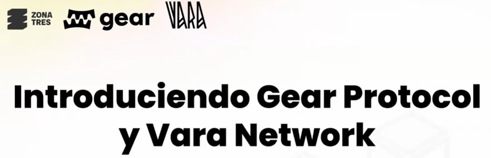
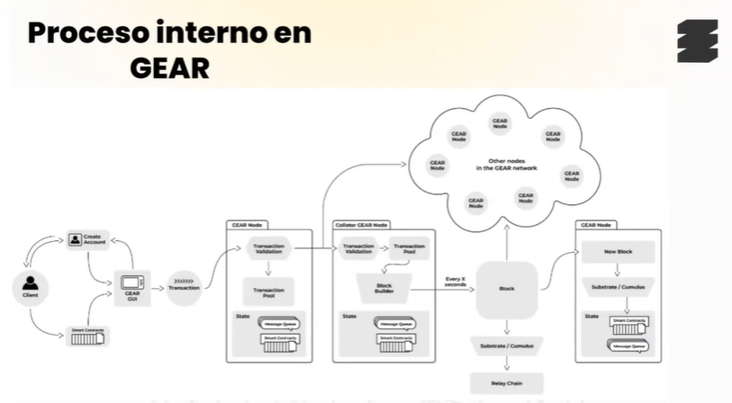
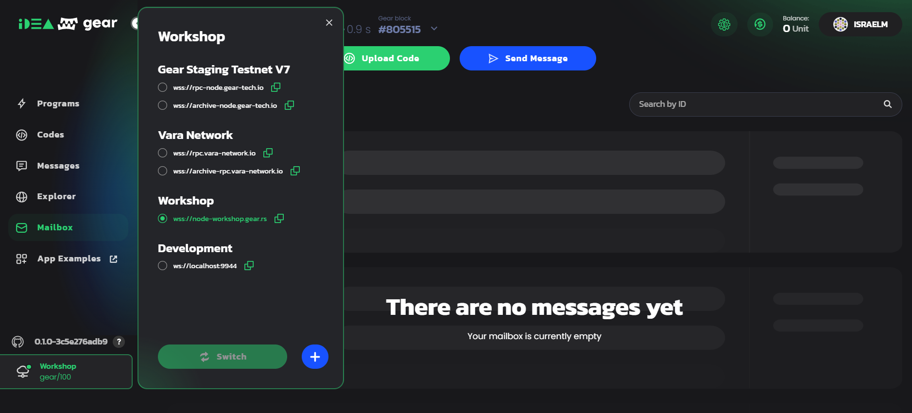
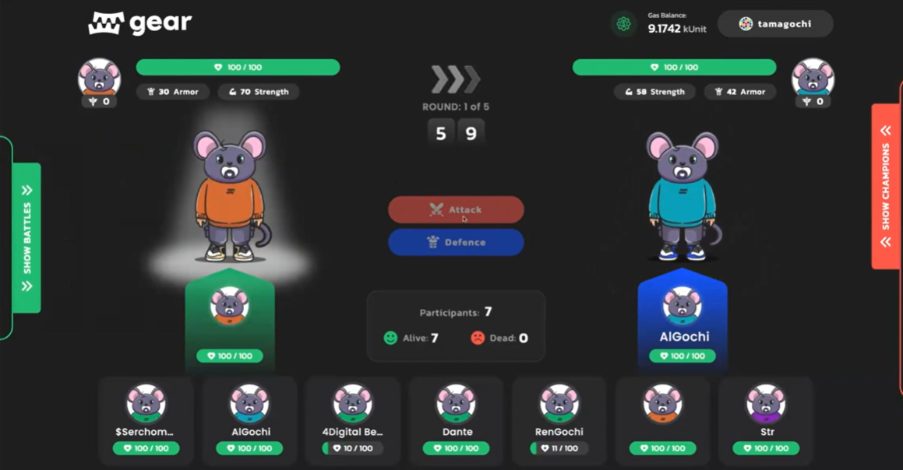

[Video](https://www.youtube.com/watch?v=iqjnB_jZKpg&t=8242s)
[Presentación](https://docs.google.com/presentation/d/1NoqB-PSS4qt2nyY2h5NFhEf_2cqfTATs/edit#slide=id.p3)

### Aplicaciones descentralizadas (dApps)

* DeFi, DEX, NFT, tokens sociales ... 

* Smart Contracts son aplicaciones en blockchain de transacción. 

### Gear

* Esta basado en Substrate y su plataforma con WASM. 
* Gear Smart Contracts se ejecutan en WASVM
* Lenguaje Rust

* [Gear page](https://www.gear-tech.io/es)

### Gear dApp Tamagotchi battle 
* [Gear dApp Tamagotchi battle](https://github.com/orgs/gear-dapps/repositories)

> * Abrir Gitpod
> * Carpeta: src -> Archivo: lib.rs, es el codigo del Smart Contract 
> * Archivo: build.rs, es la interfaz entre Rust y WASM
> * Archivo: Cargo.toml, tiene las ligas de  librerias y paquetes
> * Ejecuta linea de comandos: " make init ", descarga las dependencias
> * Ejecuta linea de comandos: " make build ",
> * Ir: target -> Wasm32 -> tmg.opt.wasm (click derecho y download)
> * Ir: meta.txt (click derecho y download)

* [Ir a Gear IDEA](https://idea.gear-tech.io/programs?node=wss%3A%2F%2Fnode-workshop.gear.rs)

* Seleccionar workshops

* Conectar Wallet [Polkadot js](https://polkadot.js.org/extension/)
* Seleccionar Upload pogram, subir archivo tmg.opt.wasm
* Subir metadata: meta.txt
* Escribir nombre en Name
* Escribir nombre tamakotshi 
* Calculate gas 
* Submit

* App Frontend [Tamakotshi](http://ec2-54-215-49-19.us-west-1.compute.amazonaws.com:30696/)

* Poner la dirección de contrato y firmar la transacción. 

 
